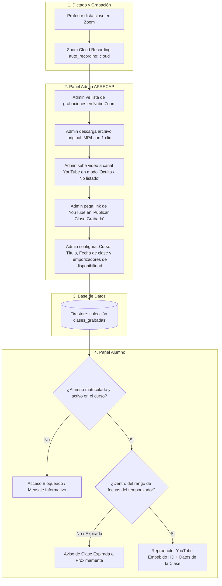

# Ecosistema de Clases Grabadas: Zoom ➡️ YouTube ➡️ APRECAP

Este documento define la arquitectura, diseño de interfaz y flujo técnico para el módulo de **Clases Grabadas y Repeticiones** en la plataforma APRECAP.

---

## 1. Visión General del Ecosistema

La estrategia diseñada permite un ahorro total de costos de almacenamiento, velocidad óptima de streaming en cualquier dispositivo y control absoluto sobre los accesos y tiempos de disponibilidad para los alumnos.



---

## 2. Ventajas Clave de este Ecosistema

1. **Cero saturación de espacio en Zoom**: Las grabaciones de Zoom se pueden descargar y luego eliminar de Zoom sin temor a perderlas.
2. **Hosting ilimitado y gratuito en YouTube**: Videos en 1080p/4K con tecnología de streaming adaptativo (los alumnos pueden ver la clase fluido incluso con señal móvil lenta).
3. **Modo Oculto (Unlisted)**: Los videos no aparecen en búsquedas públicas de YouTube; solo se pueden ver embebidos en el Panel del Alumno de APRECAP.
4. **Protección de Contenido**: El alumno **NO tiene botón de descarga directa**; solo puede visualizar la clase online dentro de la plataforma mientras esté matriculado y el temporizador esté activo.
5. **Control de Tiempos (Drip Content & Temporizadores)**: El admin decide exactamente cuándo se abre y cuándo se cierra la repetición (ej. *"Disponible desde mañana a las 09:00 AM hasta el domingo a las 23:59 PM"*).

---

## 3. Especificación de Componentes

### A. Panel Administrador (`/panel/admin`)

Dentro del panel de administración se agregarán 2 secciones/pestañas optimizadas:

#### 1. Pestaña "Grabaciones Zoom (Descargas)"
- Consulta automática a la API de Zoom (`GET /users/me/recordings`).
- Lista de reuniones finalizadas que tienen grabación en la nube.
- **Acciones para el Admin**:
  - 📥 **Botón "Descargar Video (.MP4)"**: Descarga directa a la PC del administrador.
  - 📋 **Copiar datos**: Copia rápida del tema y fecha de la clase.
  - 🗑 **Eliminar de Zoom**: Opción para limpiar la nube de Zoom una vez respaldado en YouTube.

#### 2. Pestaña "Gestión de Clases Grabadas (YouTube)"
- **Formulario para publicar una nueva grabación**:
  - **Título / Tema de la clase**: Ej. *"Módulo 1: Legislación y Marco Normativo OS-10"*.
  - **Curso asociado**: Selector desplegable (`OS-10`, `CCTV`, `Supervisor`, `Bastón`).
  - **Enlace de YouTube**: Input donde el admin pega la URL (admite `youtube.com/watch?v=...`, `youtu.be/...`, o `youtube.com/embed/...`).
  - **Fecha de la clase dictada**: Selector de fecha en que se realizó la clase.
  - **Temporizador de Disponibilidad**:
    - *Publicación inmediata* O *Programar publicación desde [Fecha y Hora]* (ej. mañana a las 09:00).
    - *Sin fecha límite* O *Vigencia hasta [Fecha y Hora]* (ej. 48 horas / 7 días / fecha del examen).
  - **Descripción / Notas adicionales**: Puntos clave tratados en la clase o material de apoyo.
- **Tabla / Lista de Clases Grabadas**:
  - Vista previa del video.
  - Estado: 🟢 *Publicada*, 🟡 *Programada (próximamente)*, 🔴 *Expirada / Oculta*.
  - Botones de **Editar**, **Pausar/Ocultar** y **Eliminar**.

---

### B. Panel Alumno (`/panel/alumno`)

Nueva pestaña / sección destacada: **"📹 Clases Grabadas (Repeticiones)"**:

- **Filtro por Curso Matriculado**: El alumno solo ve las grabaciones pertenecientes a los cursos donde tiene matrícula aprobada (`accesoOS10`, `accesoCCTV`, `accesoSupervisor`, `accesoBaston` / `enrollments`).
- **Tarjeta de Grabación**:
  - Reproductor responsivo embebido de YouTube (con controles limpios).
  - Título y Módulo correspondiente.
  - Badge con la fecha en que se dictó la clase en vivo.
  - **Badge de Temporizador**:
    - Si tiene fecha límite: ⏳ *"Disponible hasta: 24 de Agosto, 23:59 hrs (Te quedan 2 días)"*.
  - **Sin opción de descarga**: El contenido se reproduce de forma segura en streaming sin enlaces directos a los archivos MP4.

---

## 4. Estructura de Datos (Firestore)

### Colección: `clases_grabadas`

```typescript
interface ClaseGrabadaDoc {
  id?: string;
  titulo: string;                // Ej: "Módulo 2: Técnicas de Vigilancia y Rondas"
  descripcion?: string;          // Resumen o notas de la sesión
  cursoSlug: "curso-os10" | "curso-cctv" | "curso-supervisor" | "curso-baston";
  youtubeUrl: string;            // Link pegado por el admin
  youtubeVideoId: string;        // ID extraído automáticamente (ej. "dQw4w9WgXcQ")
  fechaClaseDictada: string;     // Fecha de realización (ej. "2026-08-20")
  
  // Control de Temporizadores
  disponibleDesde: string | null; // ISO string o null (si es null, disponible de inmediato)
  disponibleHasta: string | null; // ISO string o null (si es null, disponible indefinidamente)
  
  // Estado
  activa: boolean;               // true / false (switch manual del admin)
  orden?: number;
  creadoPor: string;             // Email del admin que publicó
  fechaCreacion: any;            // serverTimestamp()
}
```

---

## 5. Endpoints Backend y Librerías

1. **`lib/zoom.ts`**:
   - `listRecordings(from?: string, to?: string)`: Consulta a `GET /users/me/recordings`.
   - `getRecordingDownloadUrl(meetingId: string)`: Obtiene el enlace de descarga firmado del MP4.
2. **`app/api/zoom/recordings/route.ts`**:
   - `GET`: Retorna las grabaciones disponibles en Zoom con sus URLs de descarga para el admin.
3. **`lib/youtube.ts`**:
   - Utilidad para sanitizar y extraer el `videoId` desde cualquier formato de URL de YouTube (short link, mobile link, standard link).

---

## 6. Checklist de Implementación

- [ ] **1. Backend Zoom Recordings**:
  - [ ] Agregar función `listRecordings` y `getRecordingDownloadUrl` en `lib/zoom.ts`.
  - [ ] Crear endpoint `/api/zoom/recordings` (protegido para administradores).
- [ ] **2. Utilidad YouTube**:
  - [ ] Crear `lib/youtube.ts` para extraer `videoId` y generar iframe seguro.
- [ ] **3. Interfaz Panel Admin**:
  - [ ] Agregar pestaña *"Grabaciones Zoom (Nube)"* con lista y botón de descarga directa de MP4s.
  - [ ] Agregar pestaña/sección *"Clases Grabadas"* con formulario para pegar links de YouTube, fechas, curso y temporizadores.
- [ ] **4. Interfaz Panel Alumno**:
  - [ ] Agregar pestaña *"Clases Grabadas"* en `/panel/alumno`.
  - [ ] Filtrar videos según las matrículas activas del alumno.
  - [ ] Aplicar lógica de temporizadores (mostrar solo si está dentro de la fecha válida).
  - [ ] Embed de YouTube limpio y responsivo.
- [ ] **5. Reglas de Seguridad (Firestore)**:
  - [ ] Permitir lectura a alumnos matriculados y escritura solo a `admin` / `superadmin`.
